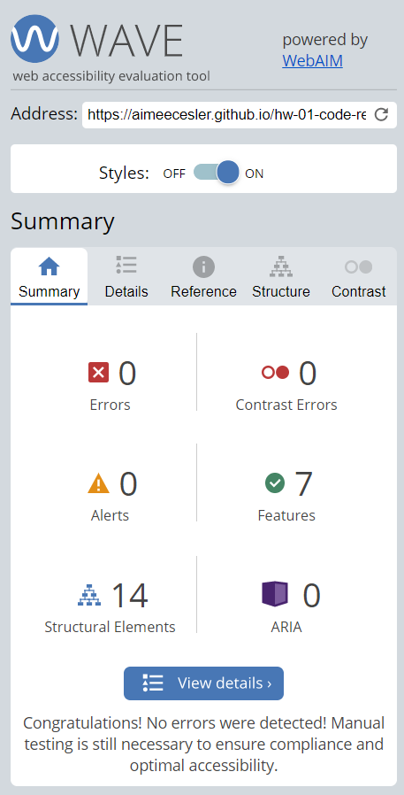

# Homework Assignment 1: HW-01-CODE-REFRACTOR
This repository contains my refactoring of the Horiseon company website. My goal was to not only create a better functioning website but to also ensure that it is compliant with all ADA requirements.

## Table of Contents
* [Installation](#installation)
* [Refactoring Process](#Refactoring-Process)
* [ADA Compliance](#ada-compliance)
* [What I Learned](#what-i-learned)
* [Acceptance Criteria](#acceptance-criteria)
* [Links](#Links)

## Installation
1. Follow the GitHub Repository Link in the [Links](#Links) section below.
1. Clone the repository using an SSH key.
1. Open GitBash and use "git clone" to clone the repository.

## Refactoring Process
During the refactoring process I made the following changes to the HTML and CSS code:
* Updated the title for a more descriptive option
* Changed all div elements to their appropriate corresponding semantic elements for ADA compliance.
    * Header
    * Nav
    * Figure
    * Main
    * Section
    * Aside
    * Footer
* Added alt text to all images on the pages that accurately described each image for ADA compliance.
* Corrected the in-page link for the Search Engine Optimization Navigation Button to function.
* Consolidated CCS selectors and properties where applicable to clean up the CSS document.
* Reorganized all CSS items to follow the HTML elements semantic structure for ease of reading.
* Added descriptive comments to all HTML and CSS items for easier editing.
* Moved the main website image from the CSS page to the HTML page to be consistent with other images.
* Renamed the image class from "hero" to "figure" for better description of the element.
* Updated the background color on the aside section for ADA contrast compliance.

## ADA Compliance
This webpage was run through the WAVE Web Accessibility Evaluation Tool to ensure compliance (https://wave.webaim.org/). There were no errors detected.

## What I Learned
1. I had no idea that there were so many things involved with making a website ADA compliant behind the scenes, it is a very interesting and detailed world that I am sure we have only scratched the surface of!

1. There are also 10,000,000+ ways to do the same thing and none of them are wrong.

1. If you stare at code for long enough, you will always find something you want to change.

## Acceptance Criteria

GIVEN a webpage meets accessibility standards :heavy_check_mark:

WHEN I view the source code :heavy_check_mark:

THEN I find semantic HTML elements :heavy_check_mark:

WHEN I view the structure of the HTML elements :heavy_check_mark:

THEN I find that the elements follow a logical structure independent of styling and positioning :heavy_check_mark:

WHEN I view the image elements :heavy_check_mark:

THEN I find accessible alt attributes :heavy_check_mark:

WHEN I view the heading attributes :heavy_check_mark:

THEN they fall in sequential order :heavy_check_mark:

WHEN I view the title element :heavy_check_mark:

THEN I find a concise, descriptive title :heavy_check_mark:

## Links
Repository Link: https://github.com/aimeecesler/hw-01-code-refractor
Deployed Application: https://aimeecesler.github.io/hw-01-code-refractor/
